

   

# ChromeOS Device Actions (Foundry app)

A Foundry application that provides response actions for ChromeOS devices. This application enables security teams to rapidly respond to device incidents through:

1. UI-driven response actions directly from the Host Management and Endpoint Detection sidebar
2. Creating automated workflow templates for device containment and state management

The current implementation allows users to contain, disable, and re-enable ChromeOS devices, with additional response capabilities planned for future releases.

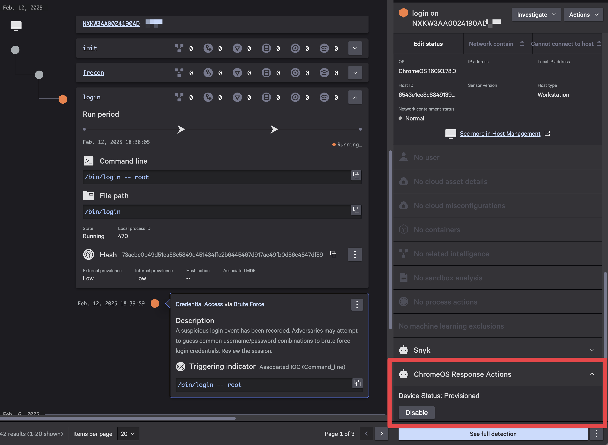

## Installation

The application can be installed through Foundry's app import functionality. You'll need appropriate permissions in your Foundry environment, as well as the appropriate GCP service account credentials to import and install the application.

### Requirements

- **Falcon Roles:**
  - Falcon Administrator
- **GCP Service Account Credentials**
  1. **Create a service account**:
     - Navigate to the [Google Cloud Console](https://console.cloud.google.com/)
     - Go to "IAM & Admin" > "Service Accounts"
     - Click "Create Service Account" and follow the [official documentation](https://cloud.google.com/iam/docs/creating-managing-service-accounts)
     - Download the JSON key file for authentication
        > Make sure to note the email address of the service account

  2. **Associate the service account with proper roles**:
     - The service account must be [associated with a role](https://support.google.com/a/answer/9807615?hl=en&ref_topic=9832445&sjid=12016677148987675569-NA#zippy=%2Cassign-a-role-to-a-service-account) in [Google Admin](https://admin.google.com/)
       > Make sure to use the email address of the service account when assigning the role

  3. **Required API scopes**:
     - Ensure the service account has the following API scopes:
       - `Manage ChromeOS Devices` - For managing ChromeOS devices
       - `Organizational Units -> read` - For viewing organizational units
- **Target Containment OU Path**
  - The path to a dedicated Organizational Unit (OU) for device containment, ideally one that enforces stricter security controls.
    > Paths can be specified as either the **full** path of the organizational unit or its **ID**.
    >
    > Examples:
    >
    >   - /MyParent/ChromeOS_Quarantine
    >   - id:01234567890
- **Google Admin Customer ID**
  - You can find this in [account settings](https://admin.google.com/u/3/ac/accountsettings)

### Download the app

The Foundry app is exported as a release artifact upon creation of new releases. To download the app:

1. Navigate to the [**Releases**](https://github.com/CrowdStrike/foundry-chromeos-device-actions/releases) page
1. Download the latest `foundry-chromeos-device-actions-<version>.tar.gz` under **Assets**
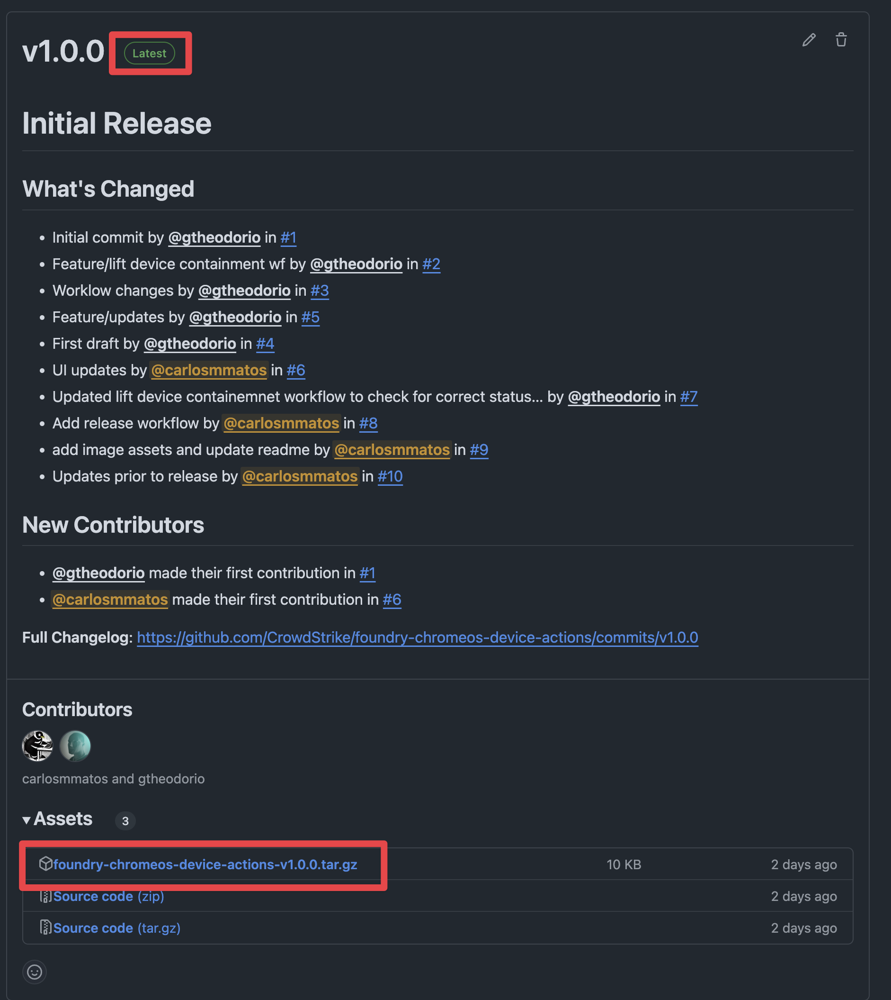
1. Save the file to your local machine

### Import the app into Foundry

> [!WARNING]
> There are limitations to importing apps in Foundry:
>
> - You can't import multiple deployment versions of the same app
> - Editing an exported file before importing it can cause the file to become invalid. Instead of editing the exported file, edit the app after import.

1. On the Falcon console, navigate to ***Foundry*** -> ***Foundry*** -> ***App manager***
1. Click on ***Import app***
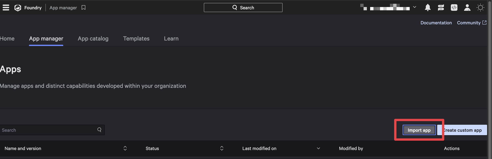
1. Click ***Upload file*** and select the downloaded `foundry-chromeos-device-actions-<version>.tar.gz` file from the previous section
1. *(Optionally)* modify the app name
1. Click ***Import*** to complete the import process

> [!NOTE]
> A message is displayed when deployment begins, and another message is displayed when deployment is complete.
>
> The deployment is automatically assigned a type of Major, with a version of 1.0.0. The change log reads Major: App Imported.

### Release the app

Release a deployment version of the app to make it available for installation and use in your CID. To release the app:

1. In **App manager** click the **Open menu** (3 dots) for the deployment you want to release and select **Release** app
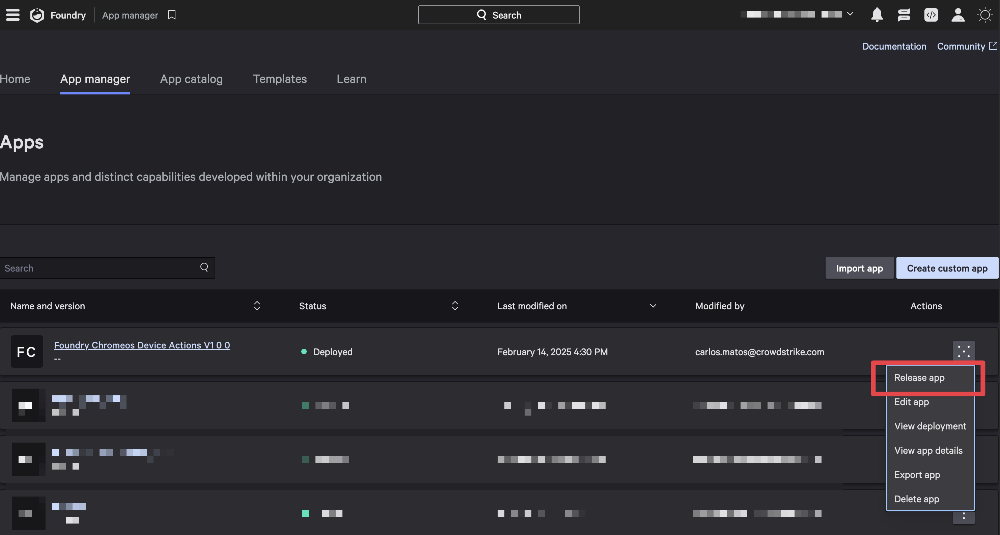
1. Select **Major** for change type, add any notes you would like to and click **Release**

This will take you to the **App overview** page after a successful release.

### Install the app

To install the Foundry app and make it available to your CID:

1. In the **App overview** page, select **View in app catalog** to navigate to the app catalog for the Chrome Device Actions app
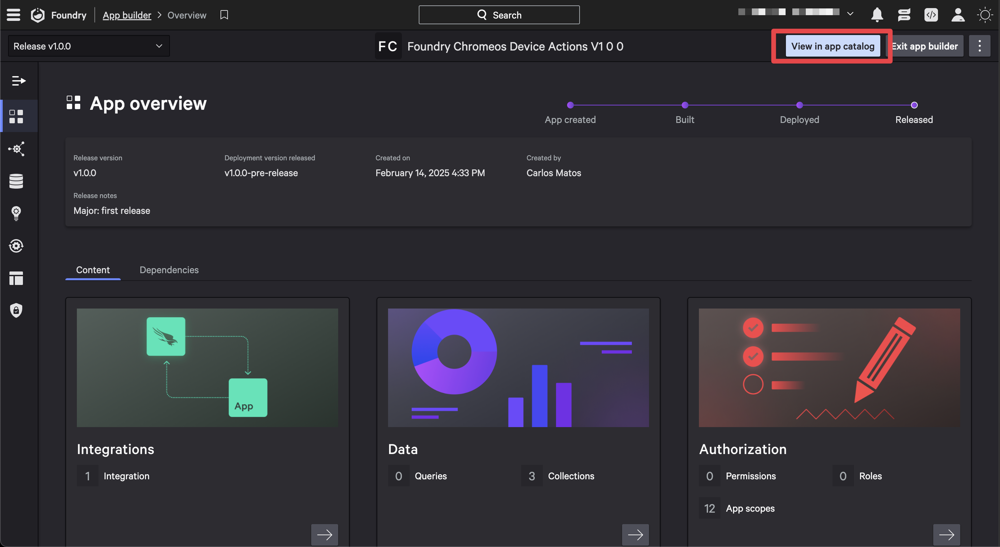
1. Click **Install now** to start the installation process
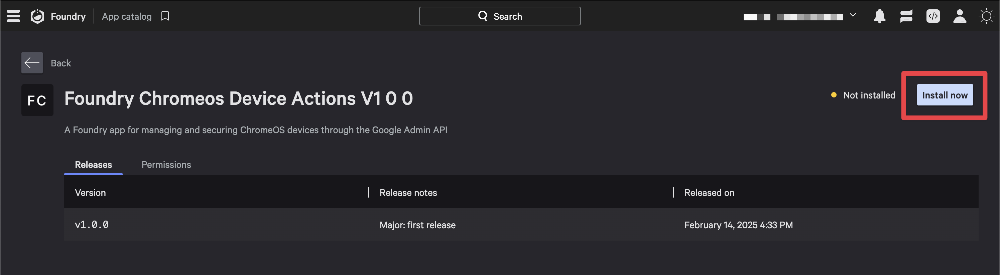
1. The application permissions will be displayed. Review them and click **Save and install** to complete the installation
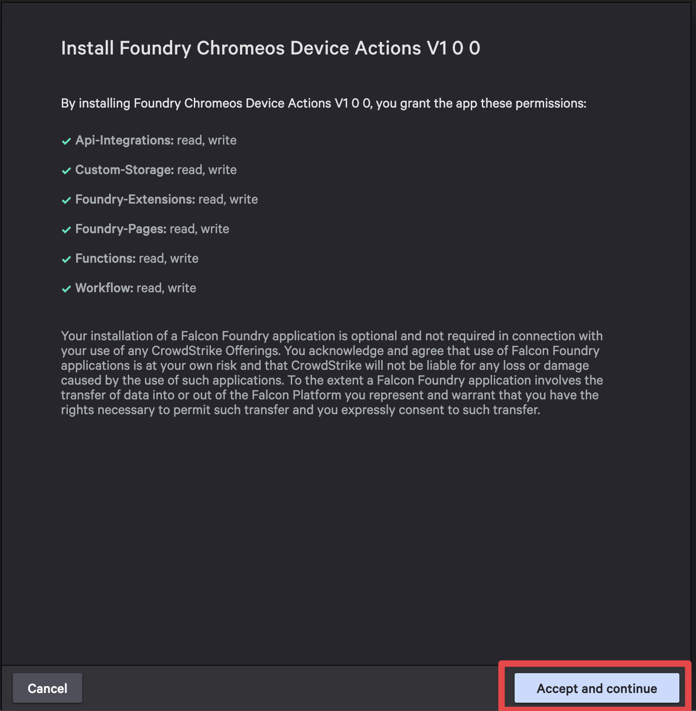
1. Fill our your Google Service Account information
   1. Enter a name for your service account credentials
   1. Upload your service account JSON key file
   1. Enter your Google Workspace customer ID
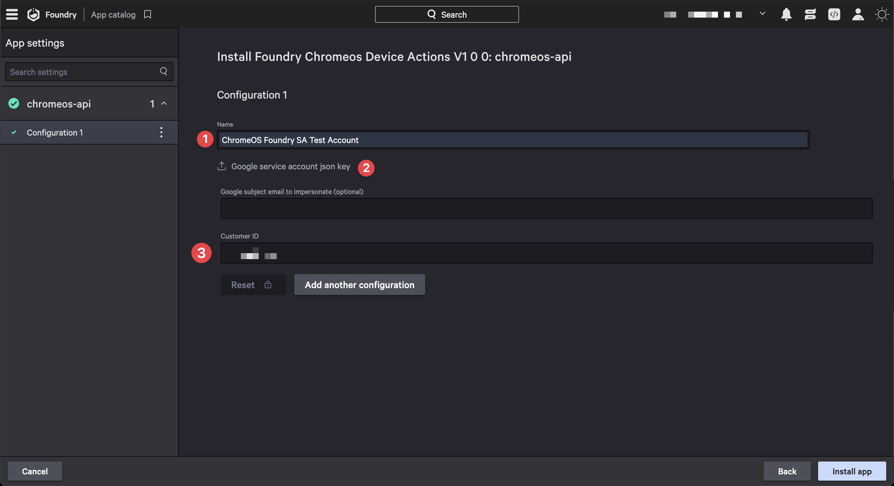
1. Click **Install app** to complete the installation

## UI Extension

The ChromeOS Device Actions (Foundry app) includes a UI Extension that provides a side panel interface in the **Host Management** and **Endpoint detections** pages. This panel allows security teams to quickly perform ChromeOS management actions directly from the CrowdStrike console without switching to the Google Admin console.

The extension allows security teams to perform actions such as disabling devices and enabling devices directly from the CrowdStrike console.

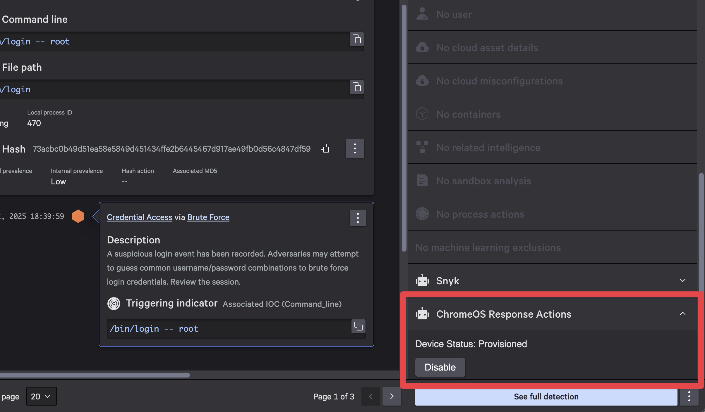

## Example Custom Fusion Workflows

The Chrome Device Actions app can be integrated with Fusion workflows to automate ChromeOS device management tasks. Here are some example workflows:

### Automated Response to ChromeOS Security Incidents

#### Workflow is triggered by a detection

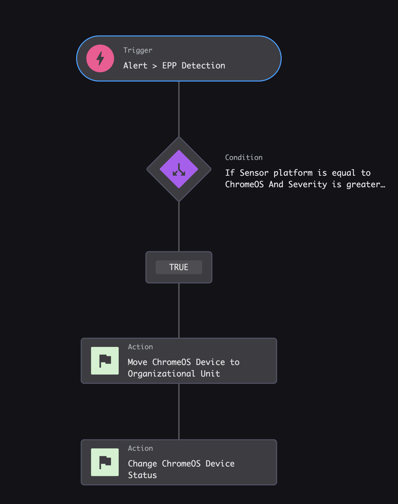

#### Workflow Condition Details

The condition checks if the detection's platform is ChromeOS and if the severity is high or critical.

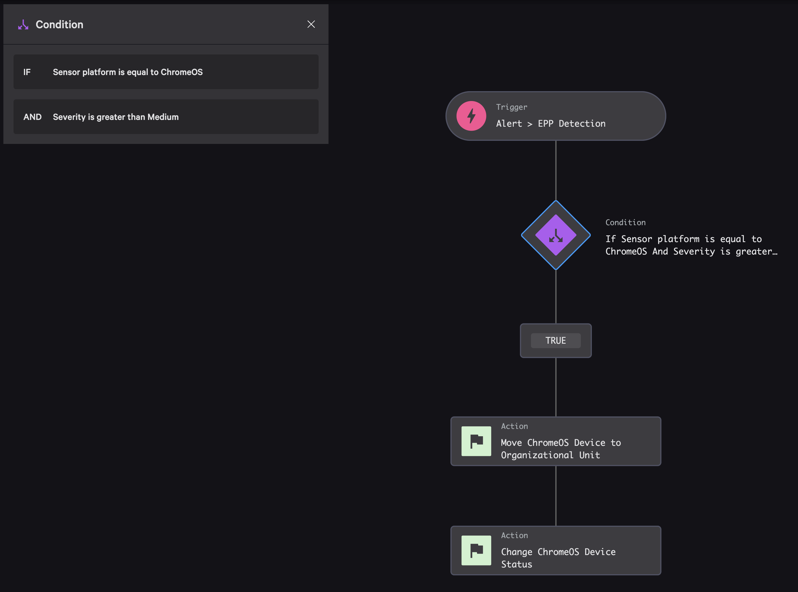

#### Workflow Action (Move Device)

This workflow action takes the device ID from the `EPP Detection` trigger and a target OU path as input.

- **Device ID (AID)**: configured as a workflow variable from: `Alerts -> EPP Detection -> Sensor host id`
- **Target OU Path**: manual input to your containment OU path

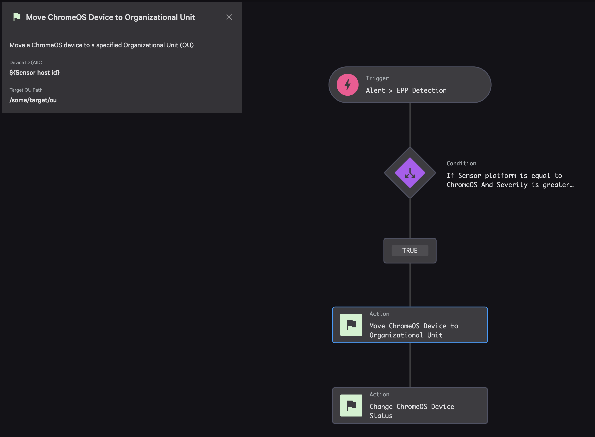

#### Workflow Action (Disable Device)

This workflow action takes the device ID from the `EPP Detection` trigger and the target device state as input. In this example we are setting the status/state to `Disabled`.

- **Device ID (AID)**: configured as a workflow variable from: `Alerts -> EPP Detection -> Sensor host id`
- **Device Status**: drop down list for device state

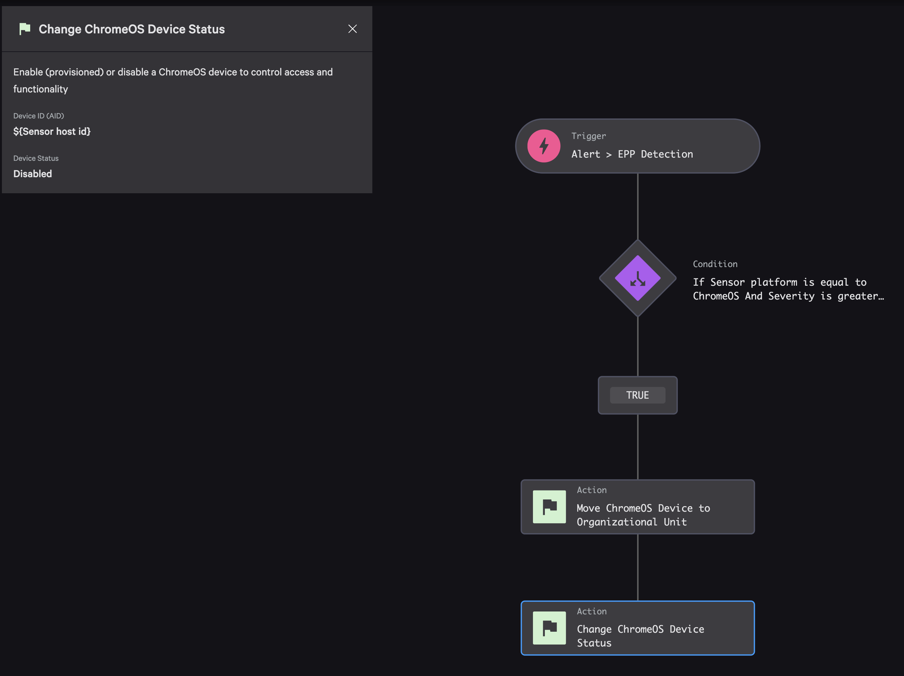

## Contributing

- [Contributing Guide](./docs/CONTRIBUTING.md)
- [Code of Conduct](./docs/CODE_OF_CONDUCT.md)

## Security

See the [SECURITY.md](./docs/SECURITY.md) file for more details about our Security Policy.

## Support

ChromeOS Device Actions (Foundry app) is a community-driven, open source project designed to provide the ability to contain, enable, disable, and gather ChromeOS device information. While not a formal CrowdStrike product, ChromeOS Device Actions (Foundry app) is maintained by CrowdStrike and supported in partnership with the open source developer community.

For additional support, please see the [SUPPORT.md](./SUPPORT.md) file.

## License

This project is licensed under the [MIT License](LICENSE)
