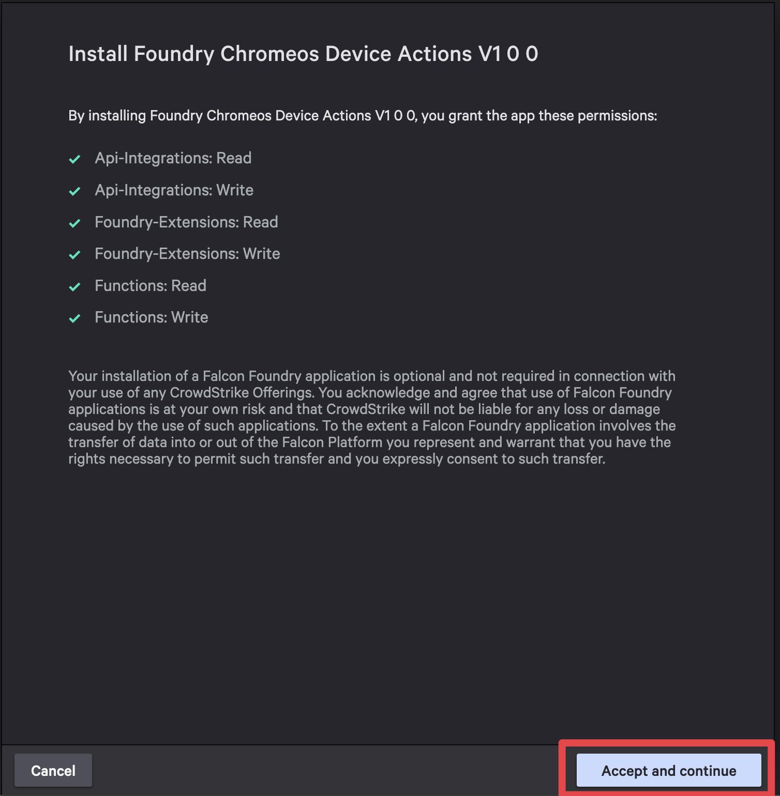

   

# ChromeOS Device Actions (Foundry app)

A Foundry application that  provides the ability to contain a device using workflow templates, enable and disable devices using a button that will appear in the Host Management sidebar for a ChromeOS device, and get device information using an API integration that can be used as part of a custom workflow.

## Installation

The application can be installed through Foundry's app import functionality. You'll need appropriate permissions in your Foundry environment, as well as the appropriate GCP service account credentials to import and install the application.

### Requirements

- **Falcon Roles:**
  - Falcon Administrator
- **GCP Service Account Credentials**
  - The service account must be [associated with a role](https://support.google.com/a/answer/9807615?hl=en&ref_topic=9832445&sjid=12016677148987675569-NA#zippy=%2Cassign-a-role-to-a-service-account) in [Google Admin](https://admin.google.com/) that has the **Manage ChromeOS Devices** privilege
- **Containment OU Path**
  - The path to a dedicated Organizational Unit (OU) for device containment, ideally one that enforces stricter security controls.
- **Google Admin Customer ID**
  - You can find this in [account settings](https://admin.google.com/u/3/ac/accountsettings)

### Download the app

The Foundry app is exported as a release artifact upon creation of new releases. To download the app:

1. Navigate to the [**Releases**](https://github.com/CrowdStrike/foundry-chromeos-device-actions/releases) page
1. Download the latest `foundry-chromeos-device-actions-<version>.tar.gz` under **Assets**

1. Save the file to your local machine

### Import the app into Foundry

> [!WARNING]
> There are limitations to importing apps in Foundry:
>
> - You can't import multiple deployment versions of the same app
> - Editing an exported file before importing it can cause the file to become invalid. Instead of editing the exported file, edit the app after import.

1. On the Falcon console, navigate to ***Foundry*** -> ***Foundry*** -> ***App manager***
1. Click on ***Import app***

1. Click ***Upload file*** and select the downloaded `foundry-chromeos-device-actions-<version>.tar.gz` file from the previous section
1. *(Optionally)* modify the app name
1. Click ***Import*** to complete the import process

> [!NOTE]
> A message is displayed when deployment begins, and another message is displayed when deployment is complete.
>
> The deployment is automatically assigned a type of Major, with a version of 1.0.0. The change log reads Major: App Imported.

### Release the app

Release a deployment version of the app to make it available for installation and use in your CID. To release the app:

1. In **App manager** click the **Open menu** (3 dots) for the deployment you want to release and select **Release** app

1. Select **Major** for change type, add any notes you would like to and click **Release**

This will take you to the **App overview** page after a successful release.

### Install the app

To install the Foundry app and make it available to your CID:

1. In the **App overview** page, select **View in app catalog** to navigate to the app catalog for the Chrome Device Actions app

1. Click **Install now** to start the installation process

1. The application permissions will be displayed. Review them and click **Save and install** to complete the installation

1. Fill our your Google Service Account information
   1. Enter a name for your service account credentials
   1. Upload your service account JSON key file
   1. Select the permission from the dropdown

1. Click **Install app** to complete the installation

## Configure Settings

Once the apps has been installed, you will need to configure the settings needed for the app to function properly.

1. Navigate to **Custom apps** and select **Settings** under the Chrome Device Actions app

1. Enter your Google Admin Customer ID and your Containment OU Path

1. Click **Save** to save your settings

## Usage

Access the workflows via **Fusion**, the custom actions while creating a **Fusion workflow**, and the Enable/Disable button within the side panel in the **Host Management** and **Endpoint detections**. The Enable/Disable button will only be visible if the selected device is a ChromeOS device. For non-ChromeOS devices (Windows, Linux) you will be presented with a disclaimer.

## Contributing

- [Contributing Guide](./docs/CONTRIBUTING.md)
- [Code of Conduct](./docs/CODE_OF_CONDUCT.md)
- Developer Guide (*coming soon*)

## Security

See the [SECURITY.md](./docs/SECURITY.md) file for more details about our Security Policy.

## Support

ChromeOS Device Actions (Foundry app) is a community-driven, open source project designed to provide the ability to contain, enable, disable, and gather ChromeOS device information. While not a formal CrowdStrike product, ChromeOS Device Actions (Foundry app) is maintained by CrowdStrike and supported in partnership with the open source developer community.

For additional support, please see the [SUPPORT.md](./SUPPORT.md) file.

## License

This project is licensed under the [MIT License](LICENSE)
